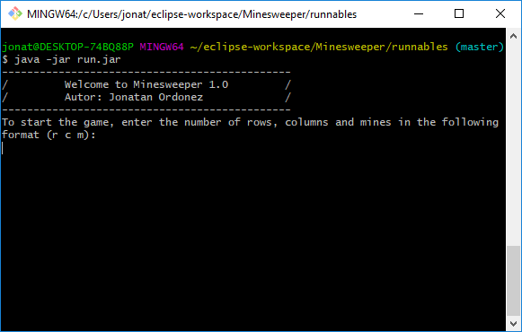
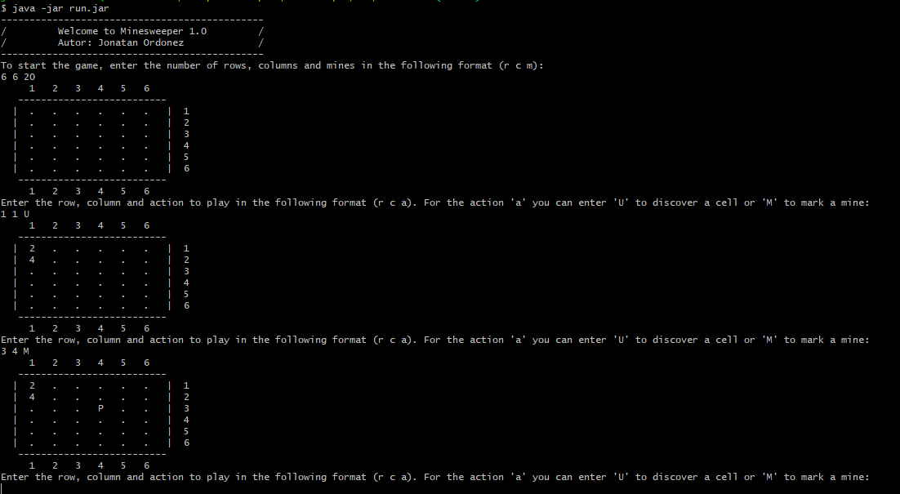

## psl-minesweeper

### **Autor:** Jonatan Ordoñez Burbano
### **E-mail:** jonatan-ordonez@hotmail.com

### Description

This project was developed in Java 8 using the libraries of JUnit Test 4.

### How to play?

First, clone the repository by executing the following command in console:
```
git clone https://github.com/JonatanOrdonez/psl-minesweeper.git
```
Next, enter to the cloned repository folder and go to the runnable folder:
```
cd psl-minesweeper/runnable
```
Finally, enter the following command to execute `run.jar` that is in the folder:
```
java -jar run.jar
```
Something like the following image should appear:



The complete game can be seen in the following image:



### Enjoy the game!!!
